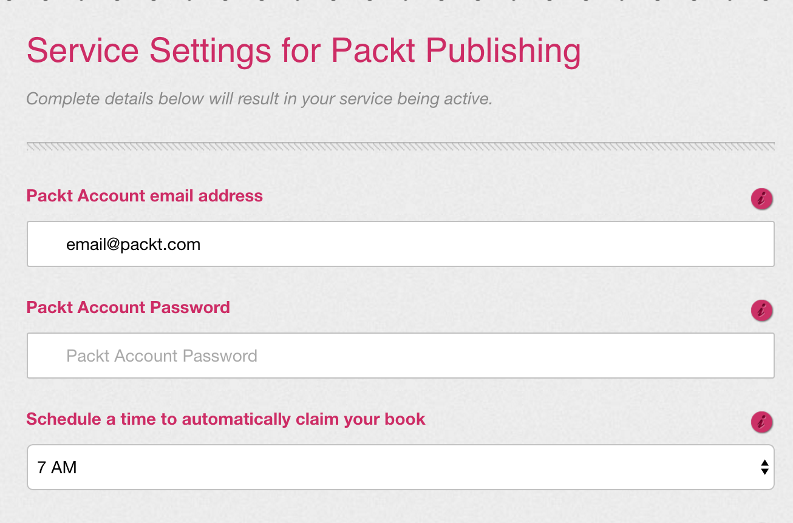

# packt-claimer
This is a web utility for claiming your Packt book automatically.

Everday Packt Publishing release a free book at: https://www.packtpub.com/packt/offers/free-learning

This NodeJS server, based apon the code from [Fabio](https://github.com/draconar/)'s repository, [grab_packt](https://github.com/draconar/grab_packt/), allows for a web request on port 80 to be sent to this Node.JS application in order to claim your book.

As this version of code in the repository runs on a web server, it means that (<i>if you're happy passing through your details in plaintext</i>), it can be run in conjunction with services like IFTTT, cron, etc.

^ <i>Obviously, not so secure.</i>

Don't want to host this yourself? Get in touch!
--------------------------------------------

We have a secure automation service up and runnning which can renew your books daily.
You will recieve daily emails informing you that your book has been claimed with the title listed.
Alternatively, for £2 a month, we have the capacity to send the title of today's Packt Publishing Free Learning book to your phone via SMS.

Below is an image of this service in action:

## Installing

Install this script in the cloned directory using the following command:

    npm install

After that run the script with the following command:

    watch -n 5000 --differences node server.js
    
Then send a web request to: `http://localhost/?email=EMAIL@HERE.COM&password=PASSWORD`
